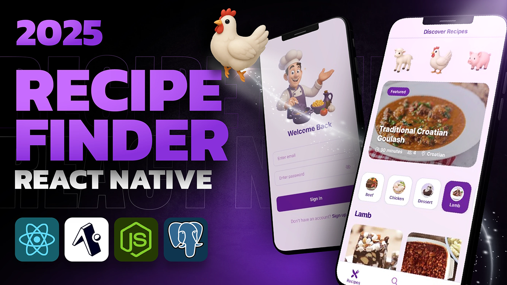

# Fullstack Recipe App 🍴

Welcome to the Fullstack Recipe App! This project is a complete recipe management application built with a modern tech stack, including Expo for the mobile frontend and Express.js for the backend.

## Features 🌟

### Mobile Application

- **User Authentication**: Sign up, sign in, and verify email using Clerk.
- **Recipe Search**: Search for recipes by name or category.
- **Favorites**: Save your favorite recipes for quick access.
- **Recipe Details**: View detailed information about recipes, including ingredients and instructions.
- **Responsive Design**: Optimized for both Android and iOS devices.

### Backend

- **Express.js Server**: Handles API requests and serves data.
- **Database Integration**: Uses Drizzle ORM for database management.
- **Cron Jobs**: Scheduled tasks for data updates.

## Installation 🛠️

### Mobile Application

1. Clone the repository:

   ```bash
   git clone https://github.com/your-repo/fullstack-recipe-app.git
   cd fullstack-recipe-app/mobile
   ```

2. Install dependencies:

   ```bash
   npm install
   ```

3. Start the app:

   ```bash
   npx expo start
   ```

4. Open the app on your device:

   - Use the Expo Go app for quick testing.
   - Run on an Android emulator or iOS simulator.

### Backend

1. Navigate to the backend directory:

   ```bash
   cd ../backend
   ```

2. Install dependencies:

   ```bash
   npm install
   ```

3. Start the server:

   ```bash
   npm run dev
   ```

## Screenshots 📸

### Mobile Application

#### Home Screen



#### Recipe Details


#### Favorites


## Learn More 📚

- [Expo Documentation](https://docs.expo.dev/): Learn about Expo and its features.
- [Express.js Documentation](https://expressjs.com/): Explore the backend framework.
- [Drizzle ORM](https://github.com/drizzle-team/drizzle-orm): Understand the database integration.

## Contributing 🤝

We welcome contributions! Feel free to open issues or submit pull requests to improve the app.

## License 📄

This project is licensed under the ISC License.
